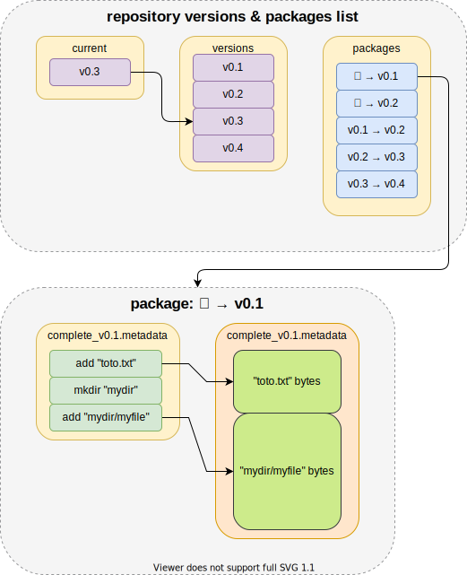

# Update system

A very efficient, reliable update system with a static repository.

**Efficiency** is achieved by:

-   minimizing download size by only downloading required parts,
-   minimizing download request: the update path is often a single big chunk of bytes
-   on the fly decompression/patching
-   on the fly integrity checks
-   resumable update process
-   Unreal Engine 4 pak file patcher (no more multigigabytes diff file)
-   very fast and with good ratio lossless codecs (brotli, zstd, ue4pak)

**Reliability** is achieved by:

-   enforcing download integrity
-   enforcing file integrity
-   auto repair process if something is wrong
-   rust borrowing rules and typings (no unwrap, no unsafe outside of codecs, ...)

**Easy to use**

-   static repository with JSON metadata
-   repository management cli tool
-   update test cli tool
-   logging infrastructure (rust [`log`](https://crates.io/crates/log))
-   C binding with update progress reporting

## Dependencies

To achieve thoses goals this library depends on:

-   [rust](https://www.rust-lang.org): a memory safe programming language
-   [future-rs](https://github.com/rust-lang/futures-rs): zero-cost Futures in Rust
-   [reqwest](https://github.com/seanmonstar/reqwest): an ergonomic, batteries-included HTTP Client for Rust,
-   [native-tls](https://github.com/sfackler/rust-native-tls): a wrapper over a platform's native TLS implementation

## Supported codecs

-   [ue4pak](https://github.com/Speedy37/ue4pak): Unreal Engine 4 pak file direct support for hyper efficient patch files
-   [zstd](https://github.com/facebook/zstd): a good compressor with very fast decompression speed (~ 800MB/s)
-   [brotli](https://github.com/dropbox/rust-brotli): a very good compressor with fast decompression speed (~ 300MB/s)
-   [lzma](https://github.com/alexcrichton/xz2-rs): an awesome compressor with slow decompression speed (~ 50MB/s)
-   [vcdiff-rs](https://github.com/Speedy37/vcdiff-rs): for vcdiff decoding

## Documentation

The documentation of repository format and some internal things is in the doc folder.

### Terminology

-   _version_: a node in the transition graph
-   _package_: an edge between two versions in the transition graph
-   _operation_: a way to synchronize a file or directory for a given relative file path
-   _repository_: a collection of packages and versions forming a transition graph with a pointer to the current version
-   _workspace_: local files managed and updated by this system

### Update logic

The update system only uses 2 threads:

-   one to manages download
-   one to apply changes to the workspace

The update logic is made of multiples stages

- _prepare_: find the shortest path of packages to download
- _update_: do the actual update
- _recover_: if something did go wrong in the update pass, try to fix it

### Repository

Here is an overview of repository files content:

 

### Project layout

- `bin/repository`: rust cli tool to manage repository (set current version, add version, ...)
- `bin/workspace`: rust cli tool to manage workspace (check integrity, update, downgrade, ...)
- `bindings/c`: C bindings to integrate workspace functionality to your program
- `src`: update system core library

## Future improvements

Split big files into smaller chunks so the repair process can only download corrupted chunks.

Add a 4th stage _workaround_: if something did go wrong again in the update pass, try to fix it by doing something else.
